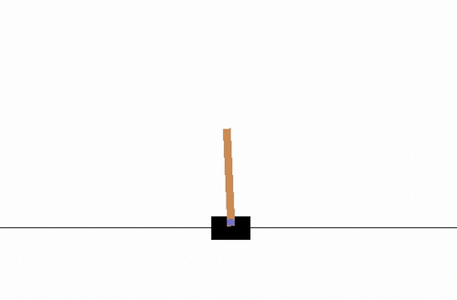

## Deep Q-Network (DQN)

In this exercise, you will implement Deep Q-Learning to solve OpenAI Gym's Cartpole environment. To begin, follow the instructions in Q-Learning-Cart.ipynb.

After you are able to get the code working, try to change the parameters in the notebook, to see if you can get the agent to train faster! 

## Results

